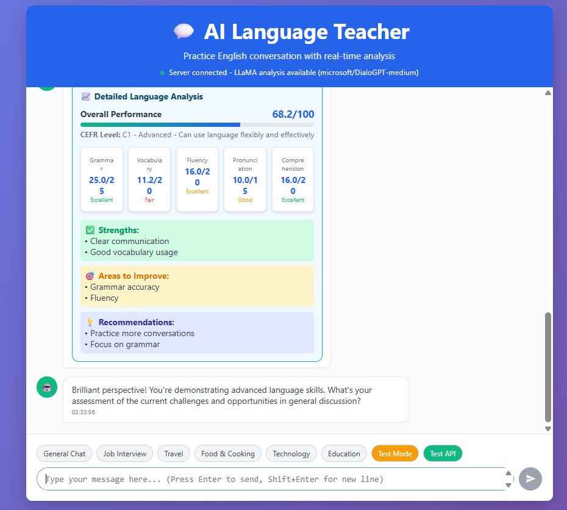

# Language Teacher Application

A comprehensive language learning application that evaluates language proficiency through conversation analysis.

## Application Interface



*Interactive conversation-style interface with real-time AI analysis and feedback*

## Features

- **LLM-Based Evaluation**: Intelligent analysis using LLaMA model for context-aware assessment
- **Real-time Conversation Analysis**: AI-powered evaluation of grammar, vocabulary, fluency, and comprehension
- **Multi-level Assessment**: Support for A1-C2 proficiency levels (CEFR)
- **Interactive AI Teacher**: Adaptive responses based on user proficiency level
- **Conversation-Style Interface**: Modern chat-based UI with real-time feedback
- **Comprehensive Scoring**: Detailed analysis with strengths, improvements, and recommendations
- **Progress Tracking**: Detailed analytics and progress visualization
- **Teacher Dashboard**: Comprehensive student monitoring and assignment management
- **Audio/Video Recording**: High-quality conversation recording with real-time feedback
- **Gamification**: Achievements, badges, and progress milestones

## Technology Stack

### Backend
- **Framework**: FastAPI (Python 3.9+)
- **AI/ML**: LLaMA (microsoft/DialoGPT-medium), OpenAI GPT-4 integration
- **NLP**: spaCy, NLTK, TextBlob
- **Database**: SQLAlchemy ORM with PostgreSQL support
- **Authentication**: JWT with OAuth2
- **Analysis**: LLM-based evaluation system

### Frontend
- **Interface**: HTML5/CSS3/JavaScript (conversation-style UI)
- **Real-time**: WebSocket connections for live analysis
- **Audio/Video**: WebRTC, MediaRecorder API (planned)
- **Responsive**: Mobile-first design

### Infrastructure
- **Containerization**: Docker & Docker Compose
- **Development**: Python virtual environment
- **Deployment**: Production-ready FastAPI server

## Quick Start

### Prerequisites
- Python 3.9+
- Node.js 16+
- PostgreSQL 14+
- Redis 6+

### Installation

1. **Clone and setup**
```bash
git clone <repository-url>
cd language_teacher
```

2. **Backend setup**
```bash
cd backend
python -m venv venv
source venv/bin/activate  # Windows: venv\Scripts\activate
pip install -r requirements.txt
```

3. **Frontend setup**
```bash
cd frontend
npm install
```

4. **Environment configuration**
```bash
cp .env.example .env
# Edit .env with your API keys and database credentials
```

5. **Database setup**
```bash
createdb language_teacher
cd backend
alembic upgrade head
```

6. **Start development servers**
```bash
# Backend (Terminal 1)
cd backend
uvicorn app.main:app --reload --port 8000

# Frontend (Terminal 2)
cd frontend
npm run dev

# Redis (Terminal 3)
redis-server
```

Visit `http://localhost:3000` to access the application.

## Project Structure

```
language_teacher/
├── backend/                 # FastAPI backend
│   ├── app/
│   │   ├── api/            # API routes
│   │   ├── core/           # Core configuration
│   │   ├── models/         # Database models
│   │   ├── services/       # Business logic
│   │   ├── utils/          # Utility functions
│   │   └── main.py         # Application entry point
│   ├── tests/              # Backend tests
│   ├── alembic/            # Database migrations
│   └── requirements.txt    # Python dependencies
├── frontend/               # React frontend
│   ├── src/
│   │   ├── components/     # React components
│   │   ├── pages/          # Page components
│   │   ├── services/       # API services
│   │   ├── store/          # Redux store
│   │   └── utils/          # Utility functions
│   ├── public/             # Static assets
│   └── package.json        # Node.js dependencies
├── docs/                   # Documentation
├── docker/                 # Docker configuration
├── scripts/                # Utility scripts
└── README.md               # This file
```

## API Documentation

Once the backend is running, visit:
- **Swagger UI**: `http://localhost:8000/docs`
- **ReDoc**: `http://localhost:8000/redoc`

## Key Features

### Conversation Analysis
- **Grammar Assessment**: Sentence structure, verb tenses, agreement
- **Vocabulary Analysis**: Word choice, complexity, appropriateness
- **Fluency Metrics**: Speaking rate, pause patterns, coherence
- **Pronunciation Scoring**: Phonetic accuracy, stress patterns
- **Comprehension Evaluation**: Context understanding, appropriate responses

### User Management
- **Student Dashboard**: Practice sessions, progress tracking, achievements
- **Teacher Dashboard**: Student monitoring, assignment creation, analytics
- **Admin Panel**: User management, system configuration, reporting

### Real-time Features
- **Live Recording**: Audio/video recording with visual feedback
- **Real-time Analysis**: Immediate feedback during conversations
- **Progress Updates**: Live progress tracking and notifications

## Development

### Code Style
- **Python**: Follow PEP 8, use type hints
- **TypeScript**: Follow ESLint rules, use strict typing
- **Testing**: Write comprehensive tests for all features
- **Documentation**: Document all public APIs and components

### Testing
```bash
# Backend tests
cd backend
pytest

# Frontend tests
cd frontend
npm test

# Integration tests
pytest tests/integration/
```

### Database Migrations
```bash
cd backend
# Create migration
alembic revision --autogenerate -m "Description"

# Apply migration
alembic upgrade head
```

## Deployment

### Production Build
```bash
# Frontend
cd frontend
npm run build

# Backend
cd backend
gunicorn app.main:app -w 4 -k uvicorn.workers.UvicornWorker
```

### Docker Deployment
```bash
docker-compose up -d
```

## Contributing

1. Fork the repository
2. Create a feature branch
3. Make your changes
4. Add tests
5. Submit a pull request

## License

This project is licensed under the MIT License - see the LICENSE file for details.

## Support

- **Documentation**: Check the `/docs` directory
- **Issues**: Open an issue on GitHub
- **Discussions**: Use GitHub Discussions for questions

## Roadmap

### Phase 1: Core Features ✅
- [x] Basic conversation recording
- [x] AI-powered analysis
- [x] User management
- [x] Progress tracking

### Phase 2: Advanced Features 🚧
- [ ] Real-time analysis
- [ ] Advanced AI integration
- [ ] Mobile app
- [ ] Offline support

### Phase 3: Enterprise Features 📋
- [ ] Multi-tenant support
- [ ] Advanced analytics
- [ ] Custom assessment criteria
- [ ] API marketplace

## Acknowledgments

- OpenAI for GPT-4 and Whisper APIs
- Google Cloud for Speech-to-Text services
- Microsoft Azure for Cognitive Services
- IBM Watson for Natural Language Understanding
- The open-source community for various libraries and tools